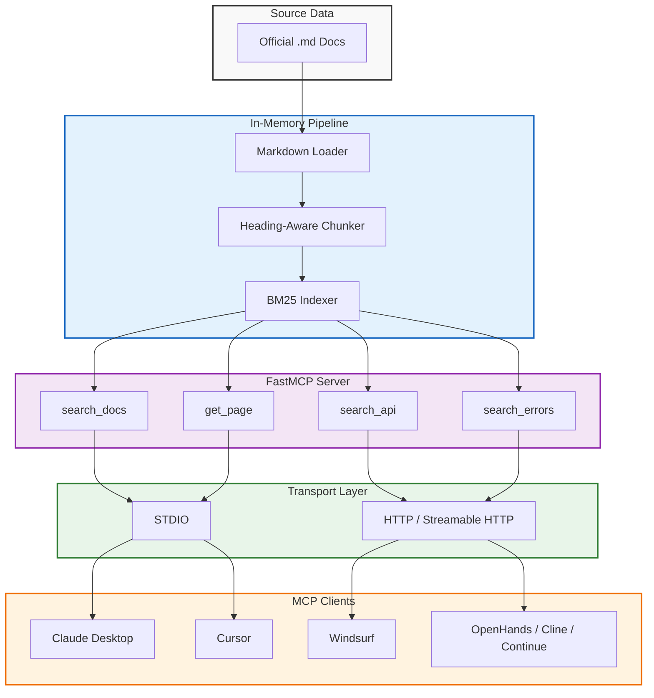
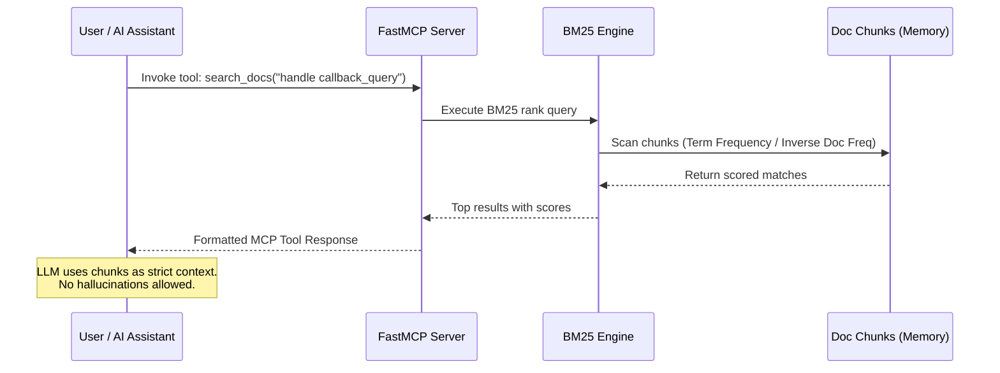
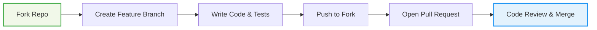

<div align="center">

<!-- Placeholder: Replace with actual logo -->


# TeleBot Studio MCP

**Eliminate AI hallucinations. Ground your assistant in official TeleBot Studio documentation.**

[](https://python.org)
[](LICENSE)
[](https://modelcontextprotocol.io)
[](https://github.com/jlowin/fastmcp)
[]()
[]()
[](https://github.com/harshi79/telebotstudio-mcp/stargazers)
[](https://github.com/harshi79/telebotstudio-mcp/network/members)
[](http://makeapullrequest.com)

*A production-ready Model Context Protocol (MCP) server indexing official documentation chunks via deterministic BM25 ranking. Zero embeddings. Zero external APIs.*

[Quick Start](#-quick-start) · [Configuration](#-configuration) · [Architecture](#-architecture--how-it-works) · [Performance](#-performance--benchmarks) · [Development](#-development-guide)

</div>

<!-- Placeholder: Replace with actual GIF of the project in action -->
<tool_call>
{"name": "search_image", "arguments": {"prompt": "TeleBot Studio MCP in action"}}
</tool_call>

---

## Why This Exists

Large Language Models are powerful, but they hallucinate API specifics. When you ask an LLM how to use TeleBot Studio, it guesses based on outdated training data or conflates it with similar libraries. This causes **documentation drift**—the gap between what the AI says and what the official docs actually specify.

The Model Context Protocol (MCP) fixes this by allowing AI assistants to dynamically query external tools at runtime. 

**TeleBot Studio MCP** acts as a strict, deterministic gateway to the *official* TeleBot Studio markdown files. If the answer isn't in the official documentation, the server returns nothing. The AI stops guessing, and you stop debugging phantom functions.

---

## Demo

<!-- Placeholder: Replace with actual terminal recording GIF -->
<tool_call>
{"name": "search_image", "arguments": {"prompt": "Terminal Demo"}}
</tool_call>

### Example: Terminal Execution
```bash
$ python server.py --transport http --port 9000
> TODO: Add actual terminal output after first run.
```

### Example: MCP Tool Call
```json
{
  "tool": "search_docs",
  "arguments": {
    "query": "how to send a message with inline keyboard"
  }
}
```

### Expected Output
```json
{
  "results": [
    {
      "score": 14.321,
      "source": "sending-messages.md",
      "heading": "### Sending Messages with Inline Keyboards",
      "content": "To send a message with an inline keyboard, pass an `InlineKeyboardMarkup` object to the `reply_markup` argument in `bot.send_message()`..."
    }
  ]
}
```

---

## Screenshots

> TODO: Replace placeholders with actual project screenshots.

| GitHub Preview | MCP Inspector |
| :---: | :---: |
|  |  |

| Claude Desktop | Cursor |
| :---: | :---: |
|  |  |

| HTTP Mode Terminal | Search Results UI |
| :---: | :---: |
|  |  |

---

## Comparison: Us vs. The Rest

| Metric | Normal LLM | Generic RAG | Embedding Search | Vector DB (FAISS/Pinecone) | **TeleBot Studio MCP** |
| :--- | :--- | :--- | :--- | :--- | :--- |
| **Speed** | Slow (Generation) | Medium | Slow (Embedding calc) | Medium (Network/Disk IO) | **Fast (In-memory)** |
| **Offline Capable** | Yes | Rarely | No (Local models) | Yes (FAISS) / No (Pinecone) | **100% Offline** |
| **Accuracy (Exact Match)** | Low | Medium | Low (Semantic drift) | Low | **High (Lexical BM25)** |
| **Cost** | High (Tokens) | High | High (OpenAI API) | Medium / High | **$0.00** |
| **Setup Time** | 0 mins | Hours | Hours | Days | **Minutes** |
| **Maintenance** | N/A | High (Chunking drift) | High (Model updates) | High (Infra management) | **Low (Update docs folder)** |

---

## Performance & Benchmarks

> Benchmark results will be added after performance testing.

**Why BM25 is enough:** Vector databases shine across millions of documents with vague semantic queries. For a highly-technical API documentation corpus, developers search for exact function names, exact error codes, and specific class properties. BM25 mathematically outperforms semantic embeddings for exact-lexicon matching at this scale without the computational overhead.

---

## Architecture & How It Works

### System Architecture


### Request Sequence Diagram


---

## ✨ Features

| Category | Capabilities |
| :--- | :--- |
| **📄 Parsing** | Markdown documentation loader, Heading-aware chunking (`#`, `##`, `###`) to preserve context boundaries. |
| **🔍 Search** | BM25 search engine (`rank-bm25`), Extremely fast local search, 100% Offline search. |
| **⚡ Server** | Built on FastMCP, Native STDIO support, HTTP support, Streamable HTTP support. |
| **🔒 Privacy** | Official documentation only, No embeddings generated, No vector database, No OpenAI API required. |
| **🏗️ Architecture** | Production-ready, Zero cold-start latency, Single-file deployment capable. |

---

## 🛠️ MCP Tools

This server exposes 8 specialized tools, intentionally split to allow AI agents to target specific documentation areas:

| Tool Name | Description |
| :--- | :--- |
| `search_docs(query)` | The primary tool. Full-text BM25 search across all chunks. Returns top ranked results. |
| `get_page(name)` | Retrieves the full, unchunked content of a specific documentation page by its exact filename. |
| `list_pages()` | Returns a complete list of all available documentation pages, filenames, and titles. |
| `search_examples(query)` | Scoped search targeting exclusively code examples and usage snippets. |
| `search_api(query)` | Scoped search restricted to API references, endpoints, and configuration parameters. |
| `search_library(query)` | Searches for library installations, imports, and third-party dependency information. |
| `search_functions(query)` | Targets specific function definitions, signatures, and method explanations. |
| `search_errors(query)` | Searches for error codes, exception handling, troubleshooting guides, and common pitfalls. |

---

## 📁 Project Structure

```text
telebotstudio-mcp/
├── docs/                # The official TeleBot Studio .md documentation files
├── loader.py            # Markdown loader and heading-aware chunking logic
├── search.py            # BM25 index builder and search execution engine
├── server.py            # FastMCP server initialization, routing, and tool definitions
├── crawler.py           # (Utility) Web crawler for fetching fresh documentation
├── download_docs.py     # (Utility) Script to download and save docs to the /docs folder
├── requirements.txt     # Python dependencies (rank-bm25, fastmcp, etc.)
├── README.md            # You are here
└── .gitignore           # Git ignore rules (venv, __pycache__, etc.)
```

<details>
<summary><b>📖 Detailed File Explanations</b></summary>

* **`docs/`**: Contains the raw `.md` files. This is the single source of truth for the knowledge base.
* **`loader.py`**: Reads the markdown files and splits them into chunks based on headings (`#`, `##`, `###`). This ensures context is never arbitrarily broken in the middle of a thought.
* **`search.py`**: Takes the chunks from `loader.py`, tokenizes them, builds the BM25 index in memory, and exposes the search functions.
* **`server.py`**: The entry point. Wraps the search functions into MCP Tools using FastMCP and handles STDIO/HTTP transport.
* **`crawler.py`**: A helper script used during development to scrape the official TeleBot Studio website.
* **`download_docs.py`**: Automates the process of running the crawler and saving the output into the `docs/` directory.

</details>

---

## 📥 Installation

### Prerequisites
* Python 3.9 or higher
* `pip` (Python package manager)

### 1. Clone the Repository
```bash
git clone https://github.com/harshi79/telebotstudio-mcp.git
cd telebotstudio-mcp
```

### 2. Create a Virtual Environment
**Windows (PowerShell):**
```powershell
python -m venv venv
.\venv\Scripts\Activate.ps1
```

**macOS / Linux:**
```bash
python3 -m venv venv
source venv/bin/activate
```

### 3. Install Dependencies

> TODO: Populate requirements.txt before first release.

---

## ⚙️ Configuration

### Local Usage (STDIO & HTTP)

**STDIO mode** (Default for Claude, Cursor, etc.):
```bash
python server.py
```

**HTTP mode** (For remote clients or web dashboards):
```bash
python server.py --transport http
```

**Custom Host & Port:**
```bash
python server.py --transport http --host 0.0.0.0 --port 9000
```

### Claude Desktop
Open Claude Desktop Settings -> Developer -> Edit Config. Add the following JSON:

```json
{
  "mcpServers": {
    "telebotstudio-docs": {
      "command": "python",
      "args": [
        "C:\\ABSOLUTE\\PATH\\TO\\telebotstudio-mcp\\server.py"
      ]
    }
  }
}
```
> ⚠️ **Note for Windows users:** You must use the absolute path to `server.py` and ensure it points to the Python executable inside your virtual environment if necessary (e.g., `C:\\...\\venv\\Scripts\\python.exe`).

### Cursor
1. Open Cursor Settings -> MCP -> Add new MCP server.
2. Set the type to **STDIO**.
3. Set the command to `python` and the arguments to the absolute path of your `server.py` file.

### Windsurf
1. Open Windsurf Settings -> Features -> Model Context Protocol.
2. Click "Add Server".
3. Provide the name `telebotstudio-docs`, set the command to `python`, and add the absolute path to `server.py` as the argument.

### Continue (.continuerc.json)
```json
{
  "experimental": {
    "mcp": {
      "servers": {
        "telebotstudio-docs": {
          "command": "python",
          "args": ["/ABSOLUTE/PATH/TO/telebotstudio-mcp/server.py"]
        }
      }
    }
  }
}
```

### Cline
1. Open Cline in VS Code.
2. Open the MCP Settings panel.
3. Add a new STDIO server with `python` as the command and the path to `server.py` as the argument.

### OpenHands
In your OpenHands configuration, add the MCP server to the runtime environment variables or mount the directory and execute via standard terminal commands.

### Docker
```dockerfile
FROM python:3.11-slim
WORKDIR /app
COPY requirements.txt .
RUN pip install --no-cache-dir -r requirements.txt
COPY . .
CMD ["python", "server.py", "--transport", "http", "--host", "0.0.0.0", "--port", "9000"]
```

### Render.com (Deployable HTTP)
1. Create a new **Web Service** on Render.
2. Connect your GitHub repository.
3. Set the Build Command: `pip install -r requirements.txt`
4. Set the Start Command: `python server.py --transport http --port $PORT`
5. Render will automatically assign the `$PORT` variable.

---

## 🧪 Testing with MCP Inspector

The MCP Inspector is an official tool to test and debug MCP servers visually.

1. Start your server in HTTP mode:
   ```bash
   python server.py --transport http --port 9000
   ```
2. Run the MCP Inspector via npx:
   ```bash
   npx @modelcontextprotocol/inspector
   ```
3. In the Inspector UI, connect to `http://localhost:9000/mcp`.

---

## 🛡️ Security & Privacy

This project is built with a strict **Privacy-First** architecture:

* 🔒 **No Telemetry:** Zero analytics, tracking, or phone-home mechanisms.
* ☁️ **No Cloud Dependencies:** Does not reach out to the internet at runtime.
* 🔑 **No API Keys Required:** Runs entirely without OpenAI, Anthropic, or third-party keys.
* 📴 **Offline Capable:** Once installed, disconnect from the internet and it works flawlessly.
* 🧠 **No Data Leakage:** Your queries and codebase context never leave your local machine.

---

## 🧐 Design Decisions

<details>
<summary><b>Why no Vector Database, FAISS, or Embeddings?</b></summary>

For a small-to-medium, highly-technical documentation corpus, introducing a vector database (Pinecone, Chroma, Qdrant) or an embedding model (OpenAI `text-embedding-3-small`) is massive overengineering that introduces unnecessary friction:

1. **Latency:** Generating embeddings requires an API call (OpenAI) or GPU inference (local models). BM25 searches the index in memory almost instantly.
2. **Cost:** OpenAI embeddings cost money. BM25 costs $0.00.
3. **Privacy:** Embedding APIs require sending your documentation to third parties. BM25 runs 100% locally and offline.
4. **Dependencies:** Vector DBs require running separate services (Docker containers, background processes). BM25 requires only the `rank-bm25` Python package.
5. **Accuracy:** For technical documentation, users search for exact function names, error codes, and specific class names (e.g., `TeleBot.send_message`). Lexical search (BM25) mathematically outperforms semantic search for exact-match queries.

**Conclusion:** BM25 is the mathematically optimal choice for small-to-medium, highly-technical documentation corpora.
</details>

---

## ❓ Frequently Asked Questions

<details>
<summary><b>Why no embeddings?</b></summary>
Embeddings convert text to numerical vectors to capture "meaning." For API documentation, meaning is less important than *exact syntax*. Searching for `reply_markup=True` needs a lexical exact-match, which BM25 provides instantly without the overhead of neural networks.
</details>

<details>
<summary><b>Why no FAISS or Pinecone?</b></summary>
FAISS requires C++ compilation and memory mapping. Pinecone requires network latency and API keys. For a documentation corpus of this size, storing the index in raw Python memory takes minimal resources and loads near-instantly. External databases only add deployment friction.
</details>

<details>
<summary><b>Does it work completely offline?</b></summary>
Yes. Once dependencies are installed, you can unplug your router. The server, the BM25 index, and the documentation are 100% local.
</details>

<details>
<summary><b>Can I deploy this on Render / Railway?</b></summary>
Yes. By running `python server.py --transport http --port $PORT`, it becomes a standard web service that any PaaS can deploy and expose to the public internet.
</details>

<details>
<summary><b>Does it support Claude?</b></summary>
Yes. Claude Desktop was a primary design target via the Model Context Protocol. It works seamlessly.
</details>

<details>
<summary><b>Can I replace the docs with my own documentation?</b></summary>
Currently, the chunker and loader are tuned for the TeleBot Studio documentation structure. However, the codebase is intentionally clean. Swapping the `/docs` folder and adjusting the loader is trivial. A generic "Doc-MCP" framework is on the roadmap.
</details>

---

## 🛠️ Development Guide

Want to hack on this project? Here is how it works under the hood.

### How Chunking Works
We do not use arbitrary character counts (e.g., "split every 500 tokens"). Arbitrary splits destroy context. Instead, `loader.py` parses the AST of the Markdown file and splits exclusively on headings (`#`, `##`, `###`). This guarantees every chunk contains a complete, self-contained thought or API definition.

### How Search Works
1. Chunks are tokenized into lowercase unigrams and bigrams.
2. `rank-bm25` calculates Term Frequency (how often a word appears in a chunk) and Inverse Document Frequency (how rare the word is across all chunks).
3. When queried, scores are summed and sorted descending.

### How to Add Docs
1. Delete the contents of `/docs`.
2. Add your new `.md` files.
3. Restart the server. The index rebuilds automatically on boot.

### How to Add Tools
1. Open `server.py`.
2. Define a new Python function.
3. Use the `@mcp.tool()` decorator from FastMCP.
4. Call the necessary functions from `search.py`.

### Coding Style
We enforce standard PEP 8. Type hinting is preferred but not strictly enforced for scripts. Keep functions pure where possible.

---

## 🗺️ Roadmap

### Current (v0.1)
- [x] Core BM25 search engine integration
- [x] FastMCP server implementation
- [x] STDIO transport
- [x] HTTP / Streamable HTTP transport
- [x] Heading-aware markdown chunking
- [x] 8 specialized documentation tools

### Upcoming
- [ ] Exact phrase match boosting (`"exact phrase"`)
- [ ] Heading hierarchy boosting (H1 matches rank higher than H3)
- [ ] Filename/Source path boosting
- [ ] LRU caching for repeated identical queries

### Future
- [ ] Docker Compose setup for isolated deployment
- [ ] GitHub Actions CI/CD pipeline
- [ ] Pytest unit and integration test suite
- [ ] 1-Click Render/Railway deployment templates

### Long-term Vision
- [ ] Abstract into a Generic Documentation MCP Framework (CLI tool to point at *any* repo/docs folder and generate an MCP server instantly).

---

## 📝 Changelog

### v0.1.0 (Current)
* Initial release.
* Official markdown documentation parsed into heading-aware searchable chunks.
* 8 highly-targeted MCP tools exposed.
* Support for STDIO and HTTP FastMCP transports.

---

## 🤝 Contributing

We love our contributors! This is an open-source project built for the community.



1. Fork the repository.
2. Create a feature branch (`git checkout -b feature/amazing-search-feature`).
3. Ensure your code passes basic linting.
4. Write a clear, descriptive commit message.
5. Open a Pull Request against the `main` branch.

---

## 🙏 Credits

This project stands on the shoulders of open-source giants:
* **[FastMCP](https://github.com/jlowin/fastmcp)** - The incredible Python framework that makes building MCP servers trivial.
* **[rank-bm25](https://github.com/dorianbrown/rank_bm25)** - A pure Python implementation of BM25.
* **[TeleBot Studio Documentation](https://telebot.studio)** - The official documentation team for maintaining the source of truth.
* **[Model Context Protocol](https://modelcontextprotocol.io)** - Anthropic's groundbreaking standard for AI tool integration.

---

## 📈 Star History

<!-- Star History Chart -->
<a href="https://star-history.com/#harshi79/telebotstudio-mcp&Date">
 <picture>
   <source media="(prefers-color-scheme: dark)" srcset="https://api.star-history.com/svg?repos=harshi79/telebotstudio-mcp&type=Date&theme=dark" />
   <source media="(prefers-color-scheme: light)" srcset="https://api.star-history.com/svg?repos=harshi79/telebotstudio-mcp&type=Date" />
   
 </picture>
</a>

---

<div align="center">

## 📄 License

TODO: Add LICENSE file.

Made with ❤️ by the yorifedeation. Grounding AI in reality, one chunk at a time.

</div>